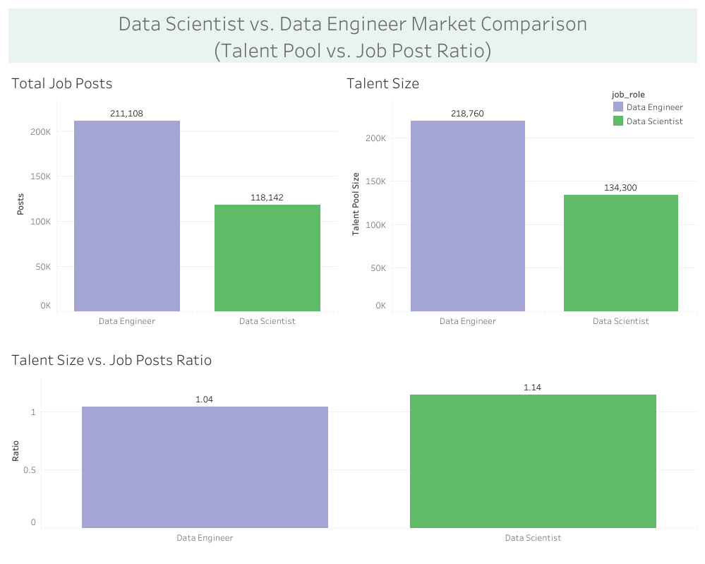
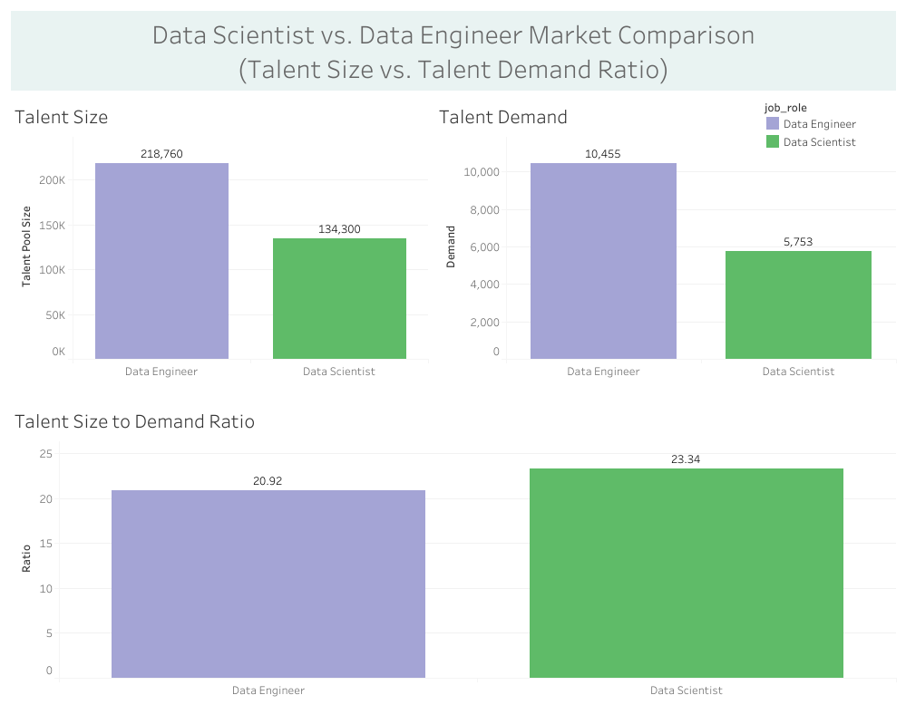
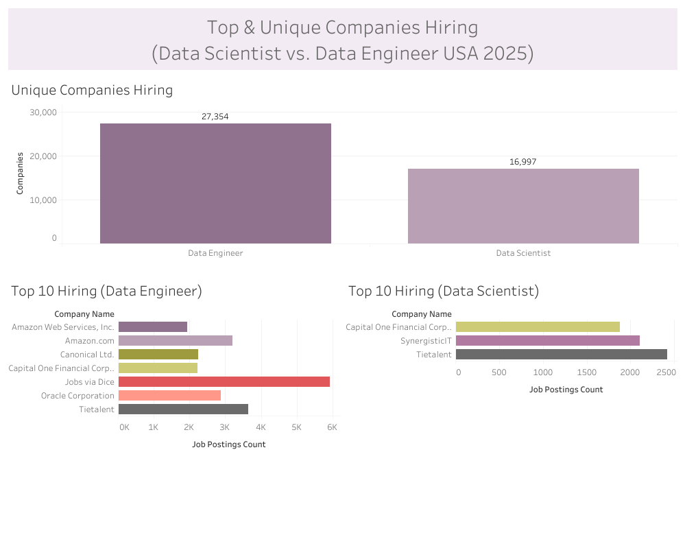
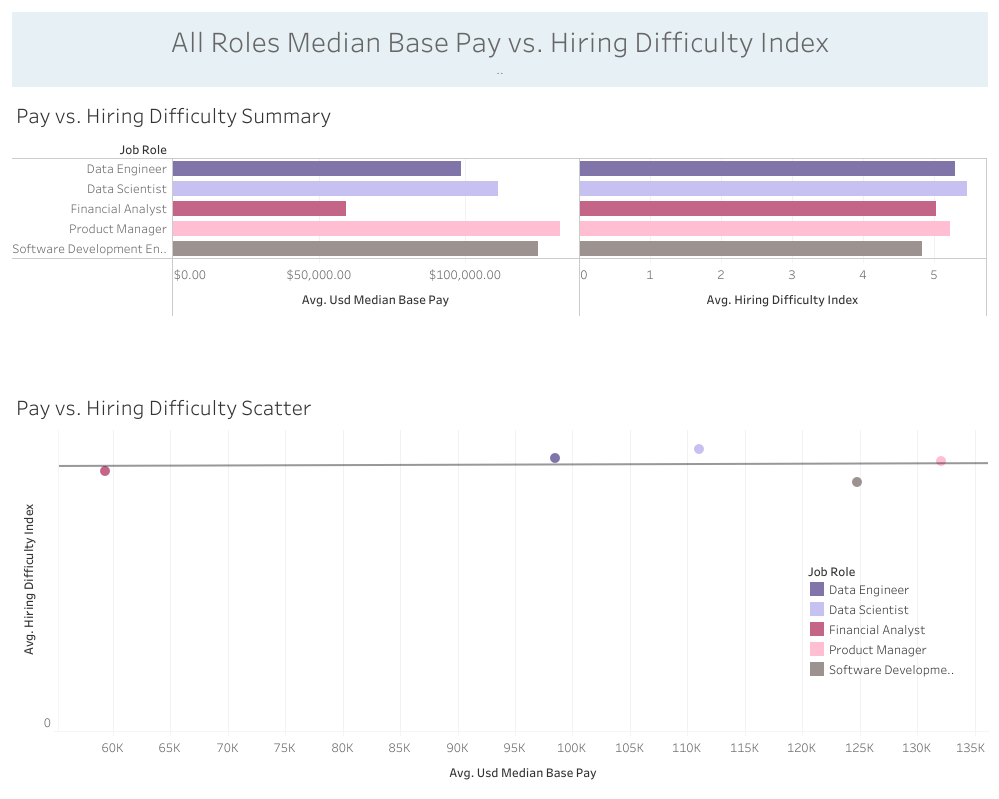

=========================================

### Document Contents
1. Restatement of Business Question/Task
2. Dataset Metadata
3. Executive Brief
   - 3a. Market Overview: Summary Tables and Visuals
   - 3b. Market Overview: Narrative 1
   - 3c. Hiring Competition Intensity: Summary Tables and Visuals
   - 3d. Hiring Competition Intensity: Narrative 2
   - 3e. Compensation and Difficulty Context: Summary Tables and Visuals
   - 3f. Compensation and Difficulty Context: Narrative 3
4. Recommendations
   
=========================================

## 1. (Deliverable) Business Question #3: Talent Supply & Demand Baseline Assessment

### Scenario

Your consulting firm has been engaged by **TechVentures Capital**, a venture capital firm that invests heavily in AI and data-driven startups. They're preparing their 2026 investment thesis and need to understand the competitive landscape for data talent in the United States.

The Managing Partner has specifically asked: _"We keep hearing that it's nearly impossible to hire Data Scientists and Data Engineers. Before we advise our portfolio companies on hiring strategies, we need hard numbers on the actual state of the market."_

### Business Questions to Answer

1. **Market Overview**: What is the current state of talent supply vs. demand for both roles? Calculate the talent-to-demand ratio (how many available professionals per open job posting).
2. **Hiring Competition Intensity**: How many companies are actively competing for this talent? Provide total unique employer counts for each role.
3. **Compensation & Difficulty Context**: What is the median base pay for each role, and how does this correlate with the hiring difficulty index?

### Deliverable Required

**Executive Brief (Markdown Report)** containing:

- A summary table comparing both roles across key metrics (supply, demand, ratios, pay, difficulty)
- 2-3 paragraph interpretation of what these numbers mean for their portfolio companies
- One clear recommendation regarding which role poses greater hiring risk

**Presentation Tip:** Your audience is non-technical investors. Keep SQL jargon out of the deliverable, focus on business insights.

=============================== REPORT START ====================================
# 2. Dataset Metadata

**Source Dataset:** `draup_inc_global_labor_market_data_talent_intelligence_sample.role_country`\
**Last Updated:** September 05, 2025\
**Accessed:** January 27, 2026

**Description:** Datasets are filtered for `'%Data%'` and `United States of America` 
jobs. 

===============================================================

# 3. Executive Brief 

### 3a. Talent Demand Summary Table

| metric                        | Data Scientist | Data Engineer |
| ----------------------------- | -------------: | ------------: |
| talent_size                   |         134300 |        218760 |
| total_posts                   |         118142 |        211108 |
| talent_demand                 |           5753 |         10455 |
| size_to_posts_ratio           |           1.14 |          1.04 |
| size_demand_ratio             |          23.34 |         20.92 |
| total_unique_companies_hiring |          16997 |         27354 |
| median_base_pay               |         144000 |     130622.67 |
| hiring_difficulty_index       |            5.9 |           5.8 |
| pay_hiring_diff_corr          |           -0.1 |          -0.1 |

**Caption:** A summary table showing comparison metrics for data scientists
and data engineers in the USA in 2025

### 3a. Talent Demand Visuals (Data Scientist vs. Data Engineer - USA 2025)

**Caption:** A dashboard showing talent pool size for data scientists
and data engineers vs. the total job posts available, along with their 
computed ratios.

**Caption:** A dashboard showing the total talent pool for data scientists
and data engineers next to the computed demand metric in the source
dataset. 

### 3b. Market Overview: Narrative 1

**Market Overview**: What is the current state of 
talent supply vs. demand for both roles? Calculate the talent-to-demand 
ratio (how many available professionals per open job posting).

**Narrative:** The results show discrepant findings based on the three 
available metrics: total talent pool, projected demand,
and active job postings. 

Based on the relationship between total talent pool and active job postings 
the data shows a favorable market for each role where the ratio of 
data scientists to individual posts is **1.14:1**, and the ratio of 
available engineers to individual posts is **1.04:1**. These conditions 
depict a healthy market for applicants in each role because competition 
for roles is low. 
For hiring, this trend is not as favorable because it represents low 
candidate diversity, thus fewer options if applied candidates 
do not meet requirements. 

Based on the relationship between total talent pool and projected demand the data
shows a highly unfavorable market for applicants, where the ratio of
data scientists to computed demand index is **23:1**, and the ratio
for data engineers is **21:1**. These conditions are unfavorable to
each applicant pool because competition is very high for single 
openings, and there are not enough openings to support the supply of each role.
The conditions are more favorable for hiring sources since they have
ample diversity in choosing the most qualified applicant for individual 
openings. 

While these conditions are more favorable for hiring, 
portfolio companies may want to consider
retention strategies with this ratio, and current 
hiring difficulty metrics which suggest finding qualified candidates in
these large pools is difficult (below, 3e). 

This discrepancy may be explained by companies posting a single opening
multiple times, which makes demand in that form appear higher than 
it actually is. Thus, the demand index would be a more accurate measure
in this case. The discrepancy may also be explained by projected demand
calculations, which make demand appear much smaller than it could be in 
the near future. In this case, job posts would be a more accurate measure for
inferring the ratio.

However, taking into consideration the hiring difficulty index values
(below, 3e), data scientists and data engineers are amongst the highest
hiring difficulty ratings, which suggests accuracy for the
demand index computation over total job posts when considering
the ratio for talent vs. demand. This difficulty could be due to the 
extent of tooling and procedures needed to carry out day-to-day tasks for 
each role. 

=====================================================================

### 3c. Hiring Competition Intensity: Summary Tables

| job_role       | country                  | total_unique_companies_hiring |
| -------------- | ------------------------ | ----------------------------: |
| Data Scientist | United States of America |                         16997 |
| Data Engineer  | United States of America |                         27354 |

| job_role       | country                  | company_name                      | job_postings_count |
| -------------- | ------------------------ | --------------------------------- | -----------------: |
| Data Engineer  | United States of America | Jobs via Dice                     |               5916 |
| Data Engineer  | United States of America | Tietalent                         |               3648 |
| Data Engineer  | United States of America | Amazon.com                        |               3201 |
| Data Engineer  | United States of America | Oracle Corporation                |               2876 |
| Data Scientist | United States of America | Tietalent                         |               2416 |
| Data Engineer  | United States of America | Canonical Ltd.                    |               2241 |
| Data Engineer  | United States of America | Capital One Financial Corporation |               2223 |
| Data Scientist | United States of America | SynergisticIT                     |               2103 |
| Data Engineer  | United States of America | Amazon Web Services, Inc.         |               1940 |
| Data Scientist | United States of America | Capital One Financial Corporation |               1882 |

### 3c. Hiring Competition Intensity: Visuals

**Caption:** A dashboard showing total unique companies hiring data 
scientists and data engineers, along with the top 10 companies
(by total job posts), hiring both data scientists and data engineers.

### 3d. Hiring Competition Intensity: Narrative 2

**Hiring Competition Intensity**: How many companies are actively 
competing for this talent? Provide total unique employer counts for 
each role.

**Narrative:** For data engineers there are 27,354 unique companies hiring
219,000 engineers, and for data scientists there are 17,000 companies hiring
134,000 data scientists. 

These numbers show that there are approximately 8 data scientists/engineers 
for every 1 company, which means that hiring should be favorable for 
companies, but the hiring difficulty index shows 
that data scientists and engineers are among the most difficult to hire.

What this means is that the pool of actual, qualified candidates
is small, and those 17K-27K companies will have to be willing to spend more
on qualified candidates, or look to poach qualified candidates from other 
companies, creating a barrier for those new to the field. 

==========================================================================

### 3e. Compensation and Difficulty Context: Summary Table

| job_role                      | country                  | talent_size | talent_demand | supply_demand_ratio | median_base_pay | usd_median_base_pay | hiring_difficulty_index |
| ----------------------------- | ------------------------ | ----------: | ------------: | ------------------: | --------------: | ------------------: | ----------------------: |
| Data Scientist                | Brazil                   |       11875 |           606 |                19.6 |       216448.94 |             41125.3 |                     5.6 |
| Data Engineer                 | United States of America |      218760 |         10455 |               20.92 |       130622.67 |           130622.67 |                     5.8 |
| Data Scientist                | United States of America |      134300 |          5753 |               23.34 |          144000 |              144000 |                     5.9 |
| Data Engineer                 | Brazil                   |       24500 |          1000 |                24.5 |       182237.84 |            34625.19 |                     5.1 |
| Data Engineer                 | India                    |      156730 |          5304 |               29.55 |         1085696 |           130283.52 |                       5 |
| Financial Analyst             | Brazil                   |       98842 |          3319 |               29.78 |       126554.51 |            24045.36 |                       6 |
| Product Manager               | United States of America |      463290 |         15499 |               29.89 |          130834 |              130834 |                     5.9 |
| Financial Analyst             | United States of America |      424675 |         13126 |               32.35 |        88886.46 |            88886.46 |                     5.7 |
| Product Manager               | Brazil                   |       35090 |          1015 |               34.57 |       148481.28 |            28211.44 |                     5.5 |
| Data Scientist                | India                    |       96504 |          2187 |               44.13 |      1231784.65 |           147814.16 |                     4.9 |
| Software Development Engineer | United States of America |     2077465 |         38534 |               53.91 |          135650 |              135650 |                     5.9 |
| Product Manager               | India                    |      241076 |          3136 |               76.87 |      1976568.13 |           237188.18 |                     4.3 |
| Software Development Engineer | Brazil                   |      194325 |          1671 |              116.29 |       189251.81 |            35957.84 |                       4 |
| Software Development Engineer | India                    |     1877465 |         15983 |              117.47 |      1689055.24 |           202686.63 |                     4.6 |
| Financial Analyst             | India                    |      267362 |          1684 |              158.77 |       541798.99 |            65015.88 |                     3.4 |

**Caption:** A summary table showing all roles, from all countries
in the source dataset, with median base pay converted to USD for each country.

### 3e. Compensation and Difficulty Context: Correlation Table

| correlation | sample_size | conf_lower_95 | conf_upper_95 |
|-------------|-------------|---------------|---------------|
| -0.0982     | 15          | -0.5812       | 0.436         |

**Caption:** A correlation table showing the correlation value
along with the confidence interval values for a 95% confidence interval.

### 3e. Compensation and Difficulty Context: Visuals

**Caption:** A dashboard showing all roles, from all countries using the 
source dataset. Median base pay converted to USD, summary bar and scatterplot. 

### 3f. Compensation and Difficulty Context: Narrative 3

**Compensation & Difficulty Context**: What is the median base pay 
for each role, and how does this correlate with the hiring difficulty 
index?

**Narrative:** The median base pay for data scientists in the USA is 
\$144,000, and the median base pay for data engineers in the USA is
\$130,000. 

When conducting a correlation upon the median base pay and hiring 
difficulty values for the entire sample (n=15), there was no 
significant correlation between median base pay and hiring difficulty.
This means that the base amount that each role makes in the market
is not influencing the hiring difficulty index, or, this is not a 
factor that is making it difficult to hire data scientists or data 
engineers. 

This insight helps reinforce the hiring difficulty on the 
employer side as being influenced by other factors such as qualifications.

This observation also provides the inference from the
candidate side that companies may not be able to pay to fix their 
qualified-candidate-scarcity issue. In other words, qualified candidates 
are not willing to accept offered rates due to prioritizing outside factors 
(work-life balance, remote opportunities, intriguing problems to solve, 
and growth). 

Lastly, this observation could suggest that there is a credentialing 
or screening issue creating barriers to entry, which
are not completely necessary, or are too strict, thus, making it seem
that more candidates are not qualified that might be. 

One limitation of these insights is that they do not consider businesses
willing to pay above the market median. There may be a relationship
between hiring difficulty and above median pay. In other words,
those companies willing to pay above the market median, may see
a less difficult time hiring data scientists and engineers. 

# 4. Recommendations

### Tight Talent Market

Because of the current hiring difficulties shown in this analysis, 
TechVenture Capital should advise their portfolio companies to
prioritize retention strategies for both data scientists and data engineers.

Data scientists pose a greater hiring risk due to their median base 
pay being \$144,000, with a hiring difficulty index of 5.9,
and data engineer median base pay being \$130,000 and a 
hiring difficulty of 5.8. While this difference is small, 
the larger total talent pool 219K for data engineers, with a lower
hiring difficulty, suggests the risk is lower for this role, and informs
cross-vetting solutions presented below.

TechVenture Capital can also advise their portfolio companies to 
look into cross-vetting solutions, where data engineering candidates, which
are more readily available in the market, and have a slightly lower
hiring difficulty index, can be vetted for their ability to 
execute data science tasks. This solution is also in line with
internally training analysts, or converting existing engineers temporarily. 
This solution is suitable to smaller companies that can't necessarily
afford to pay above the median base pay, but also to larger companies
that might have a diverse workforce, and can create collaborative team
environment where cross-training is possible.

TechVenture Capital can also advise their portfolio companies to look into
data scientists abroad, where the hiring difficulty may be lower
due to having more qualified candidates, such as India. These candidates
can be brought in as remote workers.

TechVenture Capital should also advise their portfolio companies to
reassess their screening procedures for data scientists and data 
engineers, to be sure they are not too strict, or ruling out candidates
that might actually be qualified. Along these same lines, companies
can consider assessing how close candidates are to qualifications
based on screening, and opt to bring those closest in with additional 
training. 

