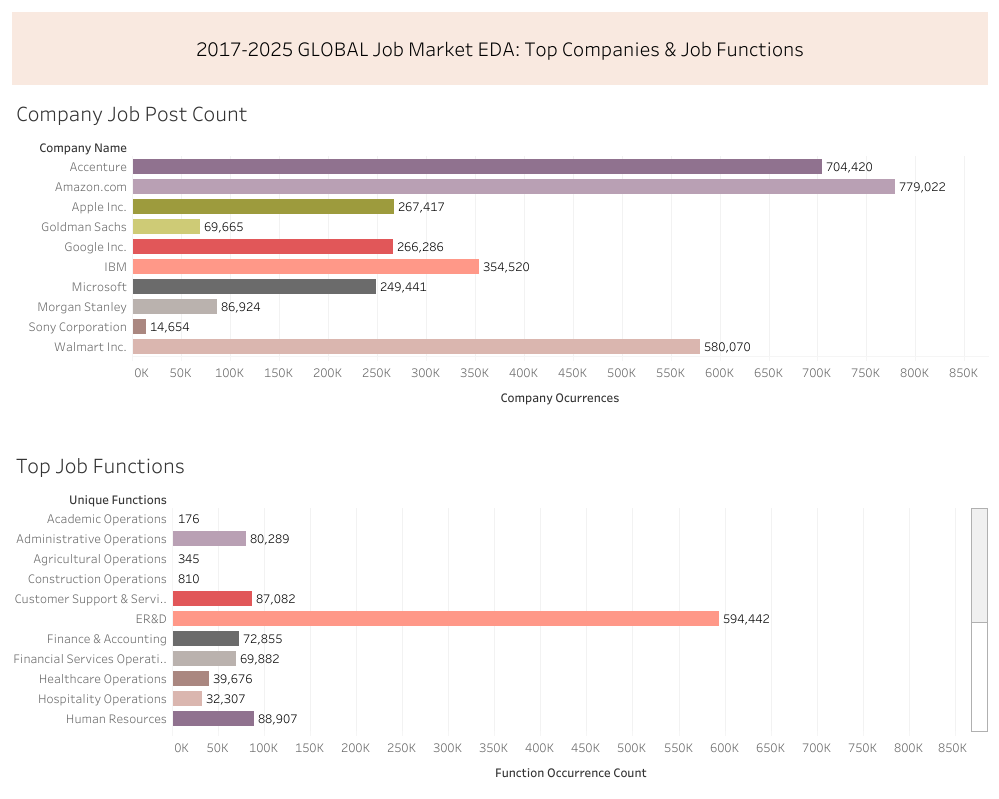
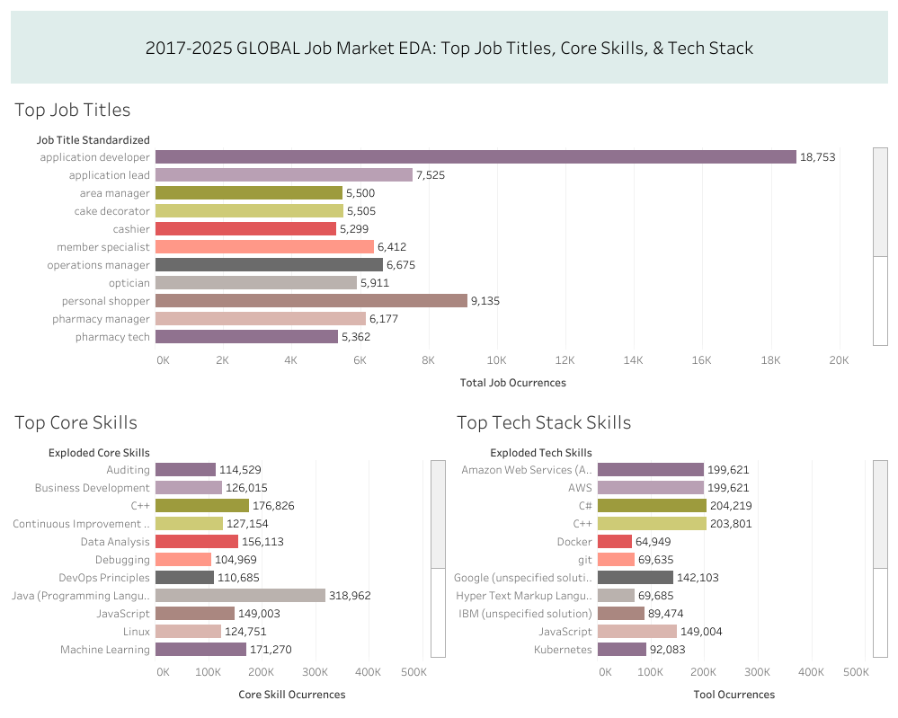
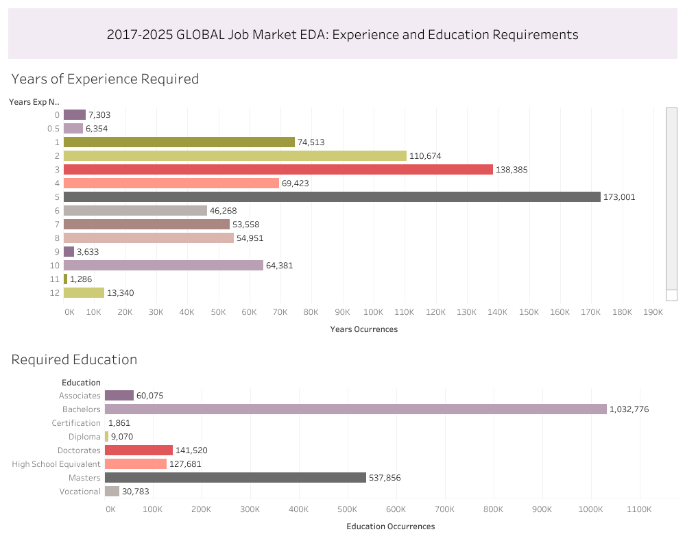

## Business Question 4 (Deliverable): Market Landscape Exploratory Data Analysis 

=========================================

Document Contents
1. Restatement of Business Question/Task
2. Dataset Metadata
3. Report 
   1. Executive Summary
   2. Dataset Profile
   3. Geographic & Company Landscape
   4. Role & Skills Intelligence
   5. Experience, Education & Requirements
   6. Temporal Patterns
   7. Key Findings & Recommendations
   
=========================================

# 1. Restatement of Business Question/Task

## Business Question 4: Market Landscape Exploratory Data Analysis

## Scenario

You've just joined **TalentPulse Analytics**, a market research firm that provides competitive intelligence and workforce insights to Fortune 500 companies, staffing agencies, and HR technology vendors. Your team has acquired a large-scale job postings dataset covering global hiring activity across major employers.

The **VP of Research** has tasked you with conducting an **initial exploratory data analysis (EDA)** to help the firm understand what's in the data and identify potential insights to pitch to clients. She's specifically said:

*"We just ingested 3+ million job postings from multiple sources, and I need to understand what we're working with before we start packaging this into client deliverables. I need you to profile this dataset across multiple dimensions—geography, companies, roles, skills, and posting patterns. Give me the lay of the land so I can decide which angles are worth deeper analysis and which client segments to target."*

The VP has outlined several areas of interest, but she wants you to explore broadly rather than go deep on any single question. This is classic **exploratory analysis**—understanding distributions, identifying patterns, and surfacing anything unusual or noteworthy.

---

# 2. Dataset Metadata

**Source Dataset:** draup_inc_draup_talent_peers_competitors_data_sample.account_intelligence.job_postings_company\
**Last Updated:** December 10, 2025\
**Accessed:** February 06, 2026

==============================BEGIN REPORT=======================================

# 1. **Executive Summary** 
   - High-level overview of the dataset
   - 2-3 key findings that stand out
   - One sentence on data quality/completeness

### High Level Overview

This dataset contains 3 million-plus job-postings, spanning the years
2017 through 2025, coming from 163 unique countries, and 10 companies
with a highly diverse set of 23 job types/functions from IT to Academic Operations.

### 2-3 Key Findings

Some key findings include that Amazon and Accenture are the top
two companies in the dataset, the US and India are the top two countries,
and the top two occurring roles are Applications Developer and
Software Development Engineer.

### Data Quality/Completeness

The data quality was judged on a by-column basis since a large
portion of the dataset included rows with missing data across
many columns. The column with the most malformatted, and unusable
data was the `minimum_index_experience` column containing a 
significant amount of variation in the ways years of required 
experience were entered for each row, so exploration implemented 
workaround solutions. 

---

# 2. **Section 1: Dataset Profile**
   - Total records, date range, unique companies
   - Data quality observations
   - Any limitations or caveats to note

### Total records, date range, unique companies

The total job posts in the dataset is 3,372,419. 

The date range for jobs posted is May 3rd, 2017 to December 7th, 2025. 
The date range for jobs updated is February 4th, 2025 to December 10, 2025. 

There are 10 unique companies in the dataset including:
- Amazon.com
- Accenture
- Walmart Inc.
- IBM
- Apple Inc.
- Google Inc.
- Microsoft
- Morgan Stanley
- Goldman Sachs
- Sony Corporation

**Dashboard:** [2017-2025 GLOBAL Job Market EDA: Top Jobs & Function Types](https://public.tableau.com/views/2017-2025GLOBALJobMarketEDA/Dashboard3?:language=en-US&:sid=&:redirect=auth&:display_count=n&:origin=viz_share_link)

### Data quality observations

The data quality is overall high quality, containing many easy
to access values in correct formats, including arrays and structs 
which are easily exploded for aggregations, as well as 
properly formatted dates for temporal analysis. 

### Any limitations or caveats to note

One data limitation that severely impacted the amount of usable
data for analyzing years of experience was the `minimum_index_experience`
column. This column contained values that were too diverse and 
malformatted to efficiently analyze more than a small percentage of the 
data. Specifically, some values were listed as "810 years", instead of
"8-10 years", and some values were only strings such as "minimum experience".
Thus, a small percentage of the data with years of experience
less than or equal to 30 years was used to examine a small distribution.
This filter produced the most usable sample. 

---

# 3. **Section 2: Geographic & Company Landscape**
   - Country distribution (table + narrative)
   - Top hiring companies (table + narrative)
   - Company posting distribution analysis (concentration vs. spread)

### Country distribution (table + narrative)

**Table**

| unique_countries           | country_ratios |
|----------------------------|----------------|
| United States of America  | 63.15          |
| India                     | 10.54          |
| Canada                    | 4.13           |
| Germany                   | 2.25           |
| United Kingdom            | 1.9            |
| China                     | 1.37           |
| Australia                 | 1.08           |
| Philippines               | 0.97           |
| Brazil                    | 0.96           |
| Japan                     | 0.9            |

**Narrative**

This table shows the percentage distribution of countries hosting
jobs from the total amount of job posts in the dataset. The USA and
India share the top 74% of the 3M+ job posts in the dataset. 

### Top hiring companies (table + narrative)

**Table**

| company_name     | company_ocurrences | total_posts_all_companies | company_percent_distr |
|------------------|--------------------|----------------------------|------------------------|
| Amazon.com       | 779022             | 3372419                    | 23.1                   |
| Accenture        | 704420             | 3372419                    | 20.89                  |
| Walmart Inc.     | 580070             | 3372419                    | 17.2                   |
| IBM              | 354520             | 3372419                    | 10.51                  |
| Apple Inc.       | 267417             | 3372419                    | 7.93                   |
| Google Inc.      | 266286             | 3372419                    | 7.9                    |
| Microsoft        | 249441             | 3372419                    | 7.4                    |
| Morgan Stanley   | 86924              | 3372419                    | 2.58                   |
| Goldman Sachs    | 69665              | 3372419                    | 2.07                   |
| Sony Corporation | 14654              | 3372419                    | 0.43                   |
 

**Narrative**

This table shows each unique company's total job posts, along with
the percentage distribution of posts that each company holds in 
the dataset. Amazon.com, Accenture, and Walmart Inc make up 61%
of total job posts. 

### Company posting distribution analysis (concentration vs. spread)

**Table**

| company_name     | company_ocurrences | company_ocurrence_mean | company_occurrence_std | variation_coefficient | company_z_score |
|------------------|--------------------|-------------------------|------------------------|-----------------------|-----------------|
| Amazon.com       | 779022             | 337241.9                | 254006.32              | 0.75                  | 1.74            |
| Accenture        | 704420             | 337241.9                | 254006.32              | 0.75                  | 1.45            |
| Walmart Inc.     | 580070             | 337241.9                | 254006.32              | 0.75                  | 0.96            |
| IBM              | 354520             | 337241.9                | 254006.32              | 0.75                  | 0.07            |
| Apple Inc.       | 267417             | 337241.9                | 254006.32              | 0.75                  | -0.27           |
| Google Inc.      | 266286             | 337241.9                | 254006.32              | 0.75                  | -0.28           |
| Microsoft        | 249441             | 337241.9                | 254006.32              | 0.75                  | -0.35           |
| Morgan Stanley   | 86924              | 337241.9                | 254006.32              | 0.75                  | -0.99           |
| Goldman Sachs    | 69665              | 337241.9                | 254006.32              | 0.75                  | -1.05           |
| Sony Corporation | 14654              | 337241.9                | 254006.32              | 0.75                  | -1.27           |

**Narrative**

This distribution analysis shows that job postings are not evenly 
distributed, rather, two companies dominate the distribution,
Amazon.com and Accenture. 

The distribution analysis shows each company's
total occurrences next to the average occurrences 
and the variation in occurrences. 
These values show a high variation coefficient at 75%,
meaning there is a high spread. This is reinforced by the top two companies
Amazon.com and Accenture being more than a standard deviation 
above the mean, and the lowest company, Sony being more than a 
standard deviation below the mean. 

---

# 4. **Section 3: Role & Skills Intelligence**
   - Most common job titles (table + insights)
   - Top tech stack mentions (table + insights)
   - Top core skills (table + insights)
   - Commentary on what this tells us about market demand

**Dashboard:** [2017-2025 GLOBAL Job Market EDA: Top Job Titles, Core Skills, & Tech Stack](https://public.tableau.com/views/2017-2025GLOBALJobMarketEDA/JobTitleCoreSkillTechStack?:language=en-US&:sid=&:redirect=auth&:display_count=n&:origin=viz_share_link)

### Most common job titles (table + insights)

**Table**

| job_title_standardized                     | total_job_ocurrences |
|-------------------------------------------|----------------------|
| application developer                     | 18753                |
| staff pharmacist                         | 13734                |
| software development engineer            | 12824                |
| personal shopper                         | 9135                 |
| application lead                         | 7525                 |
| operations manager                       | 6675                 |
| senior software engineer                 | 6474                 |
| member specialist                        | 6412                 |
| warehouse team member                    | 6273                 |
| pharmacy manager                         | 6177                 |
| optician                                 | 5911                 |
| software engineer                        | 5826                 |
| tire & battery technician - automotive   | 5684                 |
| warehouse attendant                      | 5538                 |
| cake decorator                           | 5505                 |
| area manager                             | 5500                 |
| pharmacy tech                            | 5362                 |
| cashier                                  | 5299                 |
| warehouse assistant                      | 5183                 |
| warehouse worker                         | 5130                 |

**Insights**

The above table shows the top 20 jobs with the most posts. The top 3 job
types are dominated by IT roles, application developer and software 
development engineer. It is interesting to note that pharmacy and 
warehouse roles are the next most occurring types next to IT.

### Top tech stack mentions (table + insights)

**Table**

| exploded_tech_skills                          | tool_ocurrences |
|-----------------------------------------------|-----------------|
| Python (Programming Language)                | 400880          |
| Microsoft (unspecified solution)            | 360146          |
| Microsoft Office 365                        | 213550          |
| C#                                          | 204219          |
| C++                                         | 203801          |
| Amazon Web Services (AWS) (unspecified solution) | 199621   |
| AWS                                         | 199621          |
| SAP (unspecified solution)                  | 189257          |
| JavaScript                                  | 149004          |
| Google (unspecified solution)               | 142103          |
| Linux                                       | 124756          |
| Oracle (unspecified solution)               | 119875          |
| Kubernetes                                  | 92083           |
| IBM (unspecified solution)                  | 89474           |
| Microsoft Excel                             | 81108           |
| Salesforce (unspecified solution)           | 76675           |
| Microsoft PowerPoint                        | 74978           |
| Hyper Text Markup Language (HTML)           | 69685           |
| git                                         | 69635           |
| Docker                                      | 64949           |

**Insights**

Even with the diversity of job types, Python programming is the top 
tech-stack skill. When considering all tech-stack skills in the top 20 
list, Microsoft tools dominate the distribution.

### Top core skills (table + insights)

**Table**

| exploded_core_skills                     | core_skill_ocurrences |
|------------------------------------------|-----------------------|
| Python (Programming Language)           | 400968                |
| Structured Query Language (SQL)        | 341413                |
| Project Management                     | 333957                |
| Java (Programming Language)            | 318962                |
| Microsoft Office                      | 205557                |
| Software Development                  | 199044                |
| C++                                   | 176826                |
| Machine Learning                      | 171270                |
| Data Analysis                         | 156113                |
| Scripting                             | 152961                |
| JavaScript                            | 149003                |
| Marketing                             | 145171                |
| Program Management                    | 132484                |
| Continuous Improvement Strategies     | 127154                |
| Business Development                  | 126015                |
| Linux                                 | 124751                |
| Auditing                              | 114529                |
| DevOps Principles                     | 110685                |
| Debugging                             | 104969                |
| Tableau                               | 100678                |

**Insights**

These core skills show a bit more broad skills, considering the more
diverse palette of job types. As it turns out IT skills still dominate. 
Project/program management, marketing, and auditing are amongst the few non-IT
core skills that made it into the top 20 list. 

### Commentary on what this tells us about market demand

These insights shed light on the intense demand for IT job types, and
skills. There are a few job types such as pharmacy roles, and warehouse 
roles that are in high demand, but very few core skills that do not 
have to do with IT. 

---

> NOTE: The messy data workaround procedure can be examined in 
> the bq4 notebook included in the file hierarchy

# 5. **Section 4: Experience, Education & Requirements**
   - Experience distribution
   - Education requirements
   - What this suggests about hiring standards

**Dashboard:** [2017-2025 GLOBAL Job Market EDA: Experience and Education Requirements](https://public.tableau.com/views/2017-2025GLOBALJobMarketEDA/Dashboard2?:language=en-US&:sid=&:redirect=auth&:display_count=n&:origin=viz_share_link)

### Experience distribution

| years_exp_normalized | years_ocurrences |
|----------------------|------------------|
| 5                    | 173001           |
| 3                    | 138385           |
| 2                    | 110674           |
| 1                    | 74513            |
| 4                    | 69423            |
| 10                   | 64381            |
| 8                    | 54951            |
| 7                    | 53558            |
| 6                    | 46268            |
| 15                   | 13847            |

### Education requirements

| education              | education_occurrences |
|------------------------|-----------------------|
| Bachelors              | 1032776               |
| Masters                | 537856                |
| Doctorates             | 141520                |
| High School Equivalent | 127681                |
| Associates             | 60075                 |
| Vocational             | 30783                 |
| Diploma                | 9070                  |
| Certification          | 1861                  |

### What this suggests about hiring standards

These tables show that overall, jobs are requiring candidates to have
at least 2-5 years of experience. This suggests that the current job
market, as of the last 8 years between 2017-2025
is not entry-level-friendly. 

Additionally, the majority of jobs are requiring higher education, with 
an overwhelming amount of jobs requiring at least a Bachelor's degree. This
suggests that the market for those without at least a 
four-year degree is much less favorable. 

---

# 6. **Section 5: Temporal Patterns**
   - Posting activity over time
   - Any seasonal or trend observations
   - Data freshness assessment

### Posting activity over time

| year_posted | year_ocurrences | total_post_count | year_post_distr_perc |
|-------------|------------------|------------------|----------------------|
| 2022        | 571983           | 3372419          | 16.96                |
| 2025        | 491529           | 3372419          | 14.57                |
| 2021        | 462705           | 3372419          | 13.72                |
| 2024        | 430412           | 3372419          | 12.76                |
| 2023        | 336724           | 3372419          | 9.98                 |
| 2018        | 73616            | 3372419          | 2.18                 |
| 2019        | 70481            | 3372419          | 2.09                 |
| 2020        | 58312            | 3372419          | 1.73                 |
| 2017        | 10824            | 3372419          | 0.32                 |

**Insights**

This table shows that a majority of the job posts (55%) come from the years 
2022, 2025, 2021 and 2024. The largest influx in a single year of posts 
appears to be from 2020 to 2021 (12%). From 2018 to 2023 there is also a 
large influx of job posts (+8%). Lastly, there is a noticeable 
drop in posts from 2022 to 2023 (-7%).

### Any seasonal or trend observations

**Total Month Occurrences**

| month_name | month_count |
|------------|-------------|
| Oct        | 355060      |
| Aug        | 341811      |
| Sep        | 337903      |
| Jul        | 332734      |
| Jun        | 292940      |
| Nov        | 284595      |
| Apr        | 257189      |
| May        | 256748      |
| Mar        | 243284      |
| Feb        | 234869      |
| Dec        | 226123      |
| Jan        | 209163      |

**Insights**

The month count table appears to show that the fall months of the year
have the most significant presence in overall posts (Aug-Oct), with 
October having the most overall posts over all 8 years included in the data.

The last month of the year, going into the earliest months of the year 
appear to have the least amount of job posts overall (Dec-March). 

### Total Year Count by Quarter and Month

| year_posted | month_names | date_quarter | year_count |
|-------------|-------------|--------------|------------|
| 2021        | Aug         | 3            | 71968      |
| 2022        | Jun         | 2            | 67882      |
| 2022        | Jul         | 3            | 65130      |
| 2021        | Oct         | 4            | 62898      |
| 2022        | May         | 2            | 59794      |
| 2022        | Apr         | 2            | 58014      |
| 2021        | Sep         | 3            | 57665      |
| 2021        | Jul         | 3            | 52683      |
| 2022        | Aug         | 3            | 52095      |
| 2025        | Jul         | 3            | 52037      |
| 2025        | Mar         | 1            | 48796      |
| 2022        | Sep         | 3            | 47960      |
| 2021        | Nov         | 4            | 47656      |
| 2022        | Mar         | 1            | 46358      |
| 2024        | Aug         | 3            | 46076      |

**Insights**

This table counting the occurrence of each year shows that 2021
has the most occurrences for original posts, in the 3rd quarter (Jul-Sept),
followed by 2022 in the 2nd and 3rd quarter. 

Overall, this table shows that the 2nd and 3rd quarter dominate total job
posts meaning, across years, April-September is a common time for job posts
to have high influx. This could be aligned with budgeting practices,
where companies slow down hiring near the end of the year to take 
account of financial standing, and begin looking at workforce needs
early in the next year to begin hiring again. 

### Data freshness assessment

| all_post_years | all_update_years | year_post_count |
|----------------|------------------|-----------------|
| 2025           | 2025             | 689117          |
| 2024           | 2025             | 668927          |
| 2022           | 2025             | 665103          |
| 2021           | 2025             | 550612          |
| 2023           | 2025             | 497472          |
| 2018           | 2025             | 102054          |
| 2019           | 2025             | 95728           |
| 2020           | 2025             | 80230           |
| 2017           | 2025             | 23176           |

**Insights**

In reconciling this table with the previous tables showing 2021 and 2022
as the years with the most posts, 2025 is shown as the year with the 
most posts and updates compared to all other years. This means that 
while the dataset does contain a large portion of historical job post
data, it is als comprised of even more, fresh and up-to-date job posts, 
giving it utility for examining past and present trends in workforce demand.

---

# 7. **Key Findings & Recommendations** (Final section)
   - 3-5 bullet points summarizing the most interesting/actionable insights
   - 2-3 recommendations for deeper analysis areas that would be valuable to clients
   - Any suggested data quality improvements or additional fields needed

### 3-5 bullet points summarizing the most interesting/actionable insights

- This dataset highlights the heavy demand for IT, pharmacy, 
and warehouse roles, however, it only focuses on 10 unique companies, 
which is a limitation.
- This small sample of companies may cause the skew in post 
dominance by companies like Amazon.com and Accenture.
- The dataset also highlights the intense focus of companies
on hiring candidates with multiple years of experience (2-5 years),
and at least a Bachelor's degree.
- Python and Microsoft tools dominate the tech-stack, which aligns with
an IT dominated dataset of job posts
- Project/program management, marketing, auditing, and business development
are among the non-IT core-skills that make the top skills in demand.

  
### 2-3 recommendations for deeper analysis areas that would be valuable to clients

- One area for deeper analysis could be to examine if there are relationships
within individual companies across years, regarding number of job posts, and
also types of skills that fall in and out of demand
- Another area for deeper analysis may be to examine what types of roles
lean more heavily on which types of education and/or work experience
requirements.
- One final area for examination, which would be based on a more diversified
employer profile, is comparing pay and experience requirements 
across companies and roles, especially for large, market-dominant corporations, 
as they compare to smaller companies in the same industries. 

### Any suggested data quality improvements or additional fields needed

- It may be useful to try and diversify the data ingestion to include 
more unique companies.
- It would also be useful to find a more schematic way to ingest years
of experience data so it can be more easily examined at a larger scale.

==============================END REPORT=======================================

Prepared by: Anthony Goodwin\
Title: Data Analyst\
Date Completed: February 13, 2026\
Contact: [tonyamanteacts@gmail.com]
