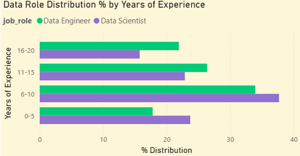

=========================================
### Document Contents:

1. Restatement of Business Question
2. Dataset Metadata
3. Data Tables/Visuals
4. Narrative/Recommendations

==========================================

# 1. **Business Question 2**

**Scenario:** A **bootcamp provider** wants to audit whether their 
programs skew too junior or too senior compared to real market demand. 
They’re considering adjusting curriculum length and prerequisites.

**Business Ask**  
For a selected role and country:
- What does the **experience distribution** of the workforce look like?
- Which experience bands align with the **largest number of job postings**?
- Is demand concentrated at entry, mid, or senior levels?

**Core SQL Tasks Exercised**
- Percentage interpretation
- Aggregations + filtering
- CTEs for staging logic
- Business-aligned grouping (experience bands)

**Expected Deliverable**
- `challenge_exp_market_alignment.md`
    - Table: experience band vs % of workforce
    - Narrative: “Where the mismatch is”
    - Optional bar chart (Power BI / Tableau optional)

====================================================

# 2. Dataset Metadata

**Source Dataset:** `draup_inc_global_labor_market_data_talent_intelligence_sample.role_country`\
**Last Updated:** September 05, 2025\
**Accessed:** January 27, 2026

**Tables/Views Created:**
- `experience_dist_perc.csv`
- `company_num_postings.csv`

**Description:** Datasets are filtered for `'%Data%'` and `United States of America` 
jobs. 

==================================================
# 3. Data Tables/Visuals

**NOTE:** For this analysis, junior is defined as 0–5 years, 
mid-level as 6–15 years, and senior as 16–20 years of experience.

### Percentage Market Distribution by Role and Years of Experience
| job_role      | yrs_exp | avg_market_dist_perc |
| ------------- | ------- | -------------------- |
| Data Engineer | 6-10    | 33.9                 |
| Data Engineer | 11-15   | 26.4                 |
| Data Engineer | 16-20   | 21.9                 |
| Data Engineer | 0-5     | 17.8                 |

**Caption:** A table showing the percentage distribution of data engineers
by years of experience in the United States as of September 2025.

| job_role       | yrs_exp | avg_market_dist_perc |
| -------------- | ------- | -------------------- |
| Data Scientist | 6-10    | 37.7                 |
| Data Scientist | 0-5     | 23.7                 |
| Data Scientist | 11-15   | 22.9                 |
| Data Scientist | 16-20   | 15.8                 |

**Caption:** A table showing the percentage distribution of data scientists
by years of experience in the United States as of September 2025.

=================================================
### Distribution Visual (Power BI)

**Caption: A clustered bar chart displaying the percentage distributions for 
data scientists and data engineers by their years of experience
in the United States as of September 2025.**

==================================================================

### Companies and Job Postings Count, Descending

| job_role       | country                    | company_name                              | job_postings_count |
|----------------|----------------------------|--------------------------------------------|--------------------|
| Data Engineer  | United States of America   | Jobs via Dice                              | 5916 |
| Data Engineer  | United States of America   | Tietalent                                  | 3648 |
| Data Engineer  | United States of America   | Amazon.com                                 | 3201 |
| Data Engineer  | United States of America   | Oracle Corporation                         | 2876 |
| Data Scientist | United States of America   | Tietalent                                  | 2416 |
| Data Engineer  | United States of America   | Canonical Ltd.                             | 2241 |
| Data Engineer  | United States of America   | Capital One Financial Corporation          | 2223 |
| Data Scientist | United States of America   | SynergisticIT                              | 2103 |
| Data Engineer  | United States of America   | Amazon Web Services, Inc.                  | 1940 |
| Data Scientist | United States of America   | Capital One Financial Corporation          | 1882 |

**Caption: A table showing companies and their total number of job postings for
data scientist and data engineering roles in the United States as of 
September 2025.**

=======================================================

# 4. Narrative

> **Summary:** Both roles show heavy mid-level concentration (~60%), 
> but Engineers have notably lower junior representation (18%),
> compared to Data Scientists, (24%). Without demand-side data by
> experience level, it is not possible to determine if this represents
> market equilibrium or opportunity.

### Distribution Description

The distribution of the workforce for data scientists is skewed towards
mid-level experienced roles (6-15 years of experience), 
holding 59% of the workforce distribution, 
while those with senior data scientist experience (16-20 years of experience) 
are at the bottom of the distribution with 15% of the workforce. 
For data scientists, junior level experience is the 2nd most common,
holding 23% of the workforce distribution.

The distribution for the data engineering community shows that 
the workforce again heavily favors those at the mid-level (59%). However,
in the data engineering community junior level experience is the least
common at 17%. 

### Data Limitations

Because the current data is limited to a descriptive analysis of the 
current workforce distribution for data scientists and engineers, 
it is not possible to accurately provide recommendations. The company needs 
to understand how market demand for different experience levels compares 
to current workforce distribution in order to tailor their curricula 
appropriately. 

The data is sufficient to describe the latter, workforce distribution,
but not sufficient to describe the distribution's relationship to demand
for various levels of experience. 

To fully compare workforce distribution against demand, 
a role-by-experience demand signal (e.g., seniority requirements by job post) 
would be required. Future iterations could incorporate job-level seniority 
extraction from postings.

### Questions for Further Analysis

The main question for further analysis is "what is the current 
market demand by the various levels of experience?" This would help in
determining the relationship between the current market distribution
and which levels employers are seeking. This would also help to determine
why there is such a high concentration of mid-level experience in the
current market distribution, and if this is due to a stable distribution/healthy
market for these roles, or if employers have an insufficient supply of 
a particular experience level.

Another question that would help the company is, "what factors are 
impacting the low distribution of juniors in data engineering?" Given 
market demand signals by experience, it could be determined if there are
barriers to entry regarding curricula for juniors, (more prerequisites needed).

================================== END OF REPORT ================================

**Prepared by:** Anthony Goodwin  
**Title:** Data Analyst  
**Date Completed:** February 1, 2026  
**Contact:** [tonyamanteacts@gmail.com]

